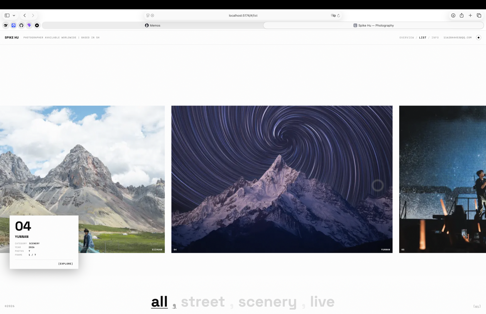
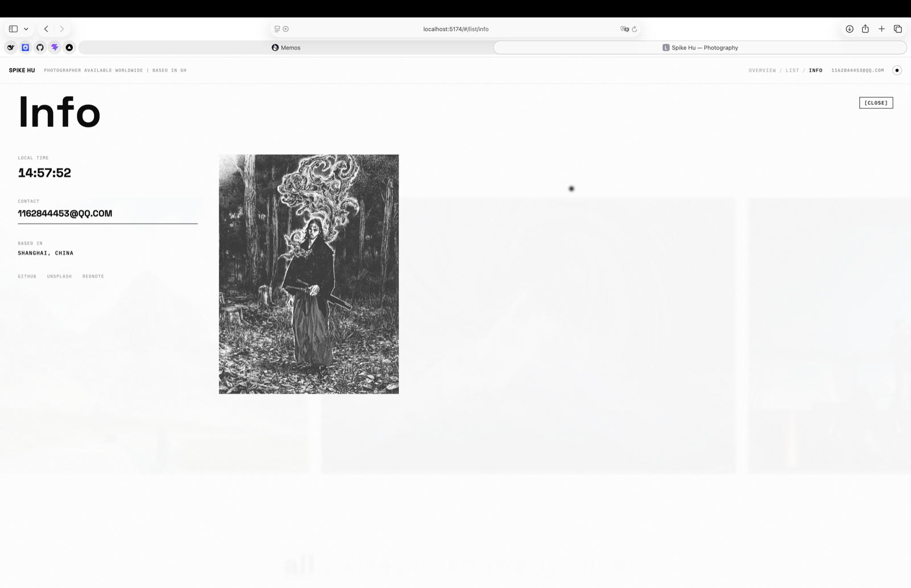

# SPIKE HU — Photography Folio

An infinite, scroll-driven photography portfolio. The gallery wall is a Three.js plane conveyor bent along a gentle cylinder — scrolling forever, every wrapped plane carrying the next photo from a shuffled lap sequence. Lenis drives the smooth scroll, GSAP/ScrollTrigger the motion. All imagery is the photographer's own work, piped from camera originals to optimized WebP by one command.


## Views

| Route | View |
|---|---|
| `#/` | **Overview** — the infinite WebGL wall, all 64 photos |
| `#/street` `#/scenery` `#/live` | Wall filtered by category (footer giant words) |
| `#/list` | Series covers strip |
| `#/p/beijing` `#/p/david-tao/9` | **Project** — a full series; deep-link straight to photo *n* |
| `… + /info` | INFO overlay (local time, contact, socials, portrait) |





## Features

- **Conveyor gallery** (Three.js) — 36 planes on a 4-column curved layout; planes scrolling off the top re-enter from the bottom bound to the next photo of a deterministically shuffled lap. One lap = every photo in the pool, no repeats; the next lap reshuffles. Column pitch sizes to the pool's tallest photo (true aspect ratios — no distortion, no overlap), with per-row z-jitter so same-column planes can never z-fight.
- **Real-progress preloader** — the counter/bar can never outrun actual bytes: progress is clamped to the first-lap thumbs loading (same shuffled list the wall binds, zero double-fetching). The masked-char intro choreography runs alongside; the gate opens when both finish.
- **Scroll-velocity motion** — per-plane rotation tilt + per-row parallax driven by the smoothed Lenis delta, `power2.inOut` easing throughout. Sub-pixel scroll (`lenis.animatedScroll`) feeds the render loop — no steppy motion.
- **Raycast interaction** — hover a plane: spotlight dim + floating series card (number, category, year, photo count, frame index). The card persists across plane seams, survives its own fade-out, and click opens the series deep-linked to that exact photo.
- **Rolling-digit odometers** — footer lap counter and project photo counter animate as rolling digit columns.
- **View transitions** — a mount-through-exit `<Transition>` keeps the WebGL gallery alive across mode switches; every transition follows the reference rhythm: exit fade → deliberate blank beat → cascade-in.
- **Custom blurred-dot cursor** (`mix-blend-mode: difference`), light/dark theme via CSS custom properties flipped inside `document.startViewTransition` (GPU cross-fade), full-screen film grain, live local-time clock.
- **Graceful fallback** — DOM masonry when WebGL is unavailable or `prefers-reduced-motion` is set.

## Photos: content pipeline

Originals live in `photo/` (git-ignored, ~1.1GB) — one folder per series, plus `avatar/`:

```
photo/
  BEIJING/  SHANGHAI/  SICHUAN/  YUNNAN/  DT/
  avatar/                                  # INFO-page portrait
```

```bash
pnpm photos   # photo/ → public/photos/ (webp) + regenerate src/photo-manifest.ts
```

- **thumb** — 720px long edge · webp q75 → gallery wall / WebGL textures (~58KB avg)
- **full** — 1920px long edge · webp q78 (q85 for the `DT` live series — dark-stage gradients) → project pages
- EXIF orientation corrected, output names content-hashed (immutable caching), stale outputs pruned, series order = shutter number

**Adding photos later**: drop files into `photo/<SERIES>/` → `pnpm photos` → commit `public/photos/` + `src/photo-manifest.ts`. Nothing else to touch — wall, routes, footer words and project pages all read the manifest.

**New series / category**: add a folder + an entry in `SERIES` at the top of `scripts/photos.mjs`, rerun. Series slugs must not collide with the reserved route words `p / list / index / info` (the script enforces this).

## Stack

React 19 · Vite 8 · TypeScript · Tailwind CSS v4 · Three.js · GSAP + ScrollTrigger · Lenis · sharp (pipeline)

## Getting started

```bash
pnpm install
pnpm dev      # http://localhost:8443 (respects $PORT)
pnpm build    # production build → dist/
pnpm preview  # preview the build
pnpm photos   # regenerate web derivatives + manifest from photo/
```

Requires Node ≥ 22.12 / pnpm (see `.mise.toml`, `engines` field).

## Project structure

```
src/
  App.tsx           # views: preloader / main / project, Lenis+GSAP wiring, chrome, transitions
  WebGLGallery.tsx  # Three.js conveyor: layout, bend, wrap-rebind, raycast, odometer
  Cursor.tsx        # blurred-dot custom cursor
  Transition.tsx    # mount-through-exit transition wrapper (gsap enter/exit)
  router.ts         # hash router (category filters, series deep links)
  shared.ts         # wall model derived from the manifest
  photo-manifest.ts # AUTO-GENERATED by scripts/photos.mjs — do not edit
  index.css         # Tailwind v4 + Lenis + cursor + theme tokens
  main.tsx          # entry
scripts/photos.mjs  # photo pipeline (sharp)
docs/               # screenshots
```

## Tunables

Key knobs live at the top of `src/WebGLGallery.tsx`: `CURVE` (bend depth), `VEL_TILT` / `MAX_TILT` (velocity tilt), `ROW_VEL` (per-row parallax), `NUM_CYCLES` (scroll length), `HOVER_HOLD` (hover hysteresis frames), and the `× 1.12` breathing factor inside `computeLayout` (column spacing vs tallest photo).

## Deploying

Push to `main` → Vercel builds (`vite build` → `dist/`) → custom domain. Hash routing keeps every deep link (`#/p/david-tao/9`) working on any static host with zero server config.
