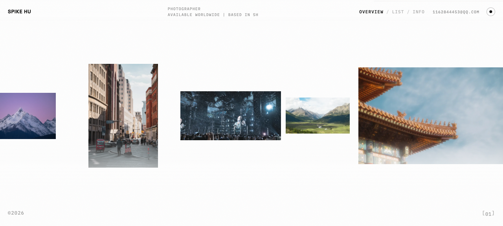
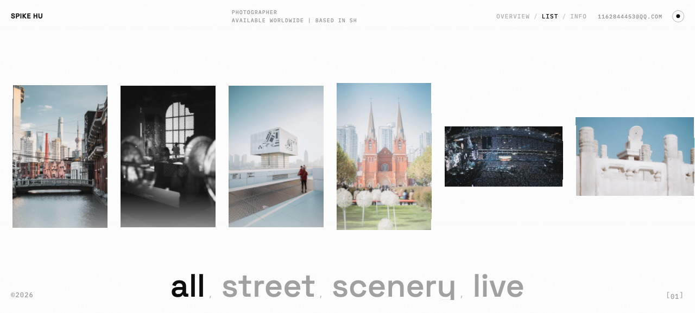
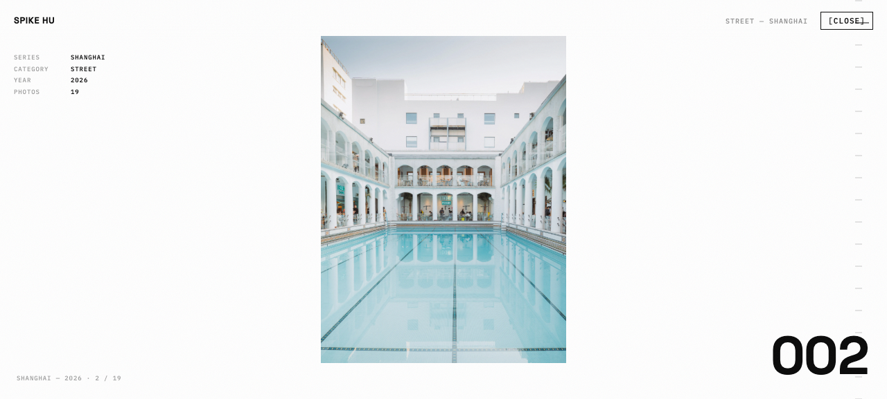
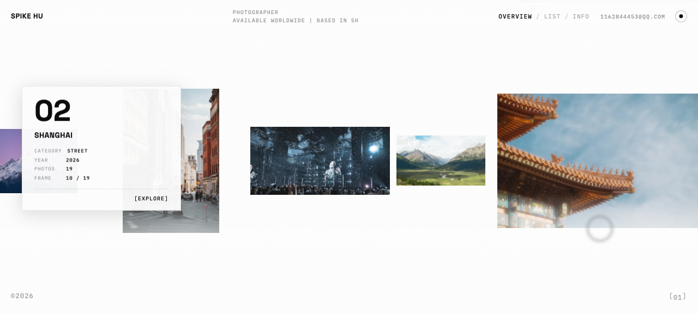
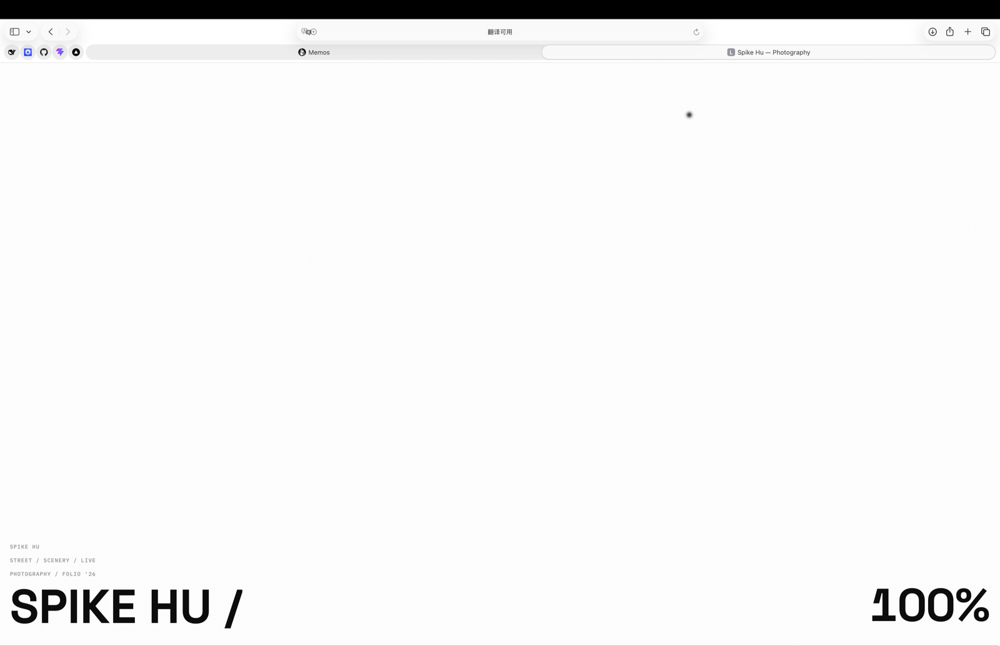
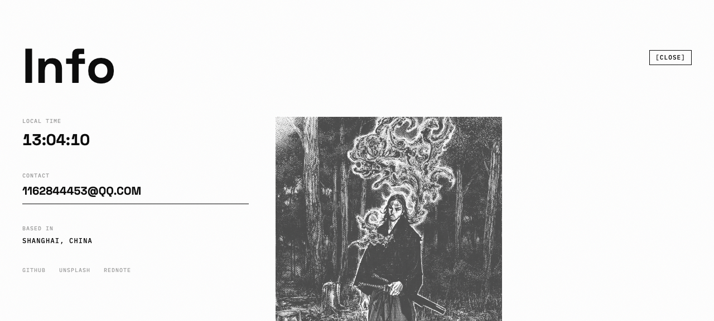

# SPIKE HU — 摄影作品集

[English](README.md) | [简体中文](README.zh-CN.md)

[](https://react.dev)
[](https://vite.dev)
[](https://tailwindcss.com)
[](https://threejs.org)
[](https://gsap.com)

## 这是什么

一个无限滚动驱动的摄影作品集。画廊是一条沿柔和圆柱面弯曲的 Three.js 平面传送带——永远滚下去，每个绕回的平面绑定随机洗牌圈序列中的下一张照片；一圈 = 每张恰好一次，下一圈重新洗牌。Lenis 负责平滑滚动，GSAP 负责动效编排，所有动画时序均按参考站点的反编译结果 1:1 复刻。线上地址 **[portfolio.vagab0nd.site](https://portfolio.vagab0nd.site)**。

| 总览墙 | 列表 · 胶片条 |
| --- | --- |
|  |  |
| **项目 · 系列页** | **悬停 · 系列卡片** |
|  |  |
| **预加载 · 真实进度** | **INFO 覆盖层** |
|  |  |

## 特性

- **传送带画廊** — 36 个平面按 4 列弧形排布，保持真实宽高比（不拉伸、不重叠）；滚出画面的平面重新入场时自动绑定圈序列的下一张照片。
- **RP 级还原动效** — intro 芯片 → 顺序堆叠弹出、总览/列表空间变形、筛选切换共用一把 1.4s 时钟（时序全部反编译自参考站，规格见 `docs/animation-spec.md`）。
- **真实进度预加载器** — 计数永远不会虚报：进度被钳制在墙自身将要绑定的首圈缩略图的真实字节上。
- **射线拾取交互** — 悬停浮出系列卡片；点击直链进入该系列的对应照片。
- **视图过渡** — WebGL 画廊在模式切换间常驻不卸载；每次过渡都踩参考站的节奏。
- **细节** — 翻页里程表、差值混合自定义光标、`startViewTransition` 内的 GPU 主题切换、胶片颗粒、实时时钟、WebGL 不可用时的 DOM 瀑布流兜底。

## 照片：一条命令

原图在 `photo/`（git 忽略）。`pnpm photos` → 优化后的 WebP（`public/photos/`）+ 重新生成的清单——墙、路由、项目页全部读清单，无需改动其他。

```
photo/
  BEIJING/  SHANGHAI/  SICHUAN/  YUNNAN/  DT/   # 每个系列一个文件夹
  avatar/                                        # INFO 页肖像
```

- **thumb** — 长边 960px · q78 → 画廊墙
- **full** — 长边 2560px · q80（暗光演出系列 q85）→ 项目页
- EXIF 方向校正、内容哈希文件名（不可变缓存）、陈旧产物自动清理

## 快速开始

```bash
pnpm install
pnpm dev      # http://localhost:8443（遵循 $PORT）
pnpm build    # 生产构建 → dist/
pnpm photos   # 从 photo/ 重新生成 web 衍生图 + 清单
```

需要 Node ≥ 22.12 / pnpm（`.mise.toml`）。

## 结构

```
src/
  App.tsx           # 视图：预加载 / 主视图 / 项目页，过渡与页面框架
  WebGLGallery.tsx  # Three.js 传送带：布局、弯曲、绕回重绑、射线拾取
  router.ts         # hash 路由（分类筛选、系列深链）
  shared.ts         # 由清单派生的墙模型
  photo-manifest.ts # 自动生成——请勿手改
scripts/photos.mjs  # 照片管线（sharp）
docs/
  animation-spec.md # 动画规格与反编译语法记录
```

核心旋钮在 `src/WebGLGallery.tsx` 顶部：`CURVE`、`VEL_TILT`、`MAX_TILT`、`ROW_VEL`、`NUM_CYCLES`、`INTRO_EXPLODE`。

## 部署

推送到 `main` → Vercel 构建 → 自定义域名。hash 路由让所有深链（`#/p/david-tao/9`）在任意静态托管上直接可用，零服务端配置。

## 许可

所有摄影作品为摄影师本人创作 — © 2026 Spike Hu，保留所有权利。代码未附开源许可。
